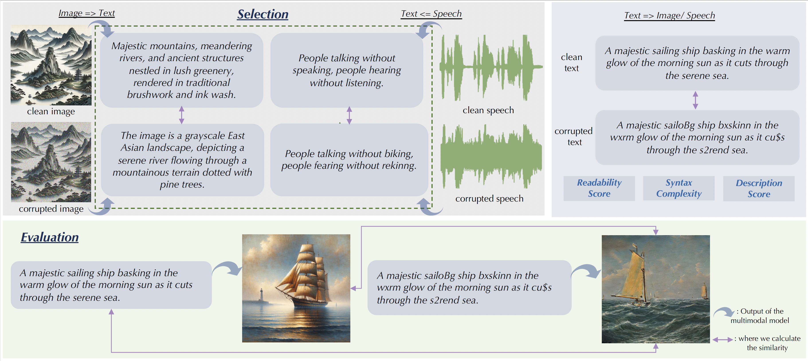
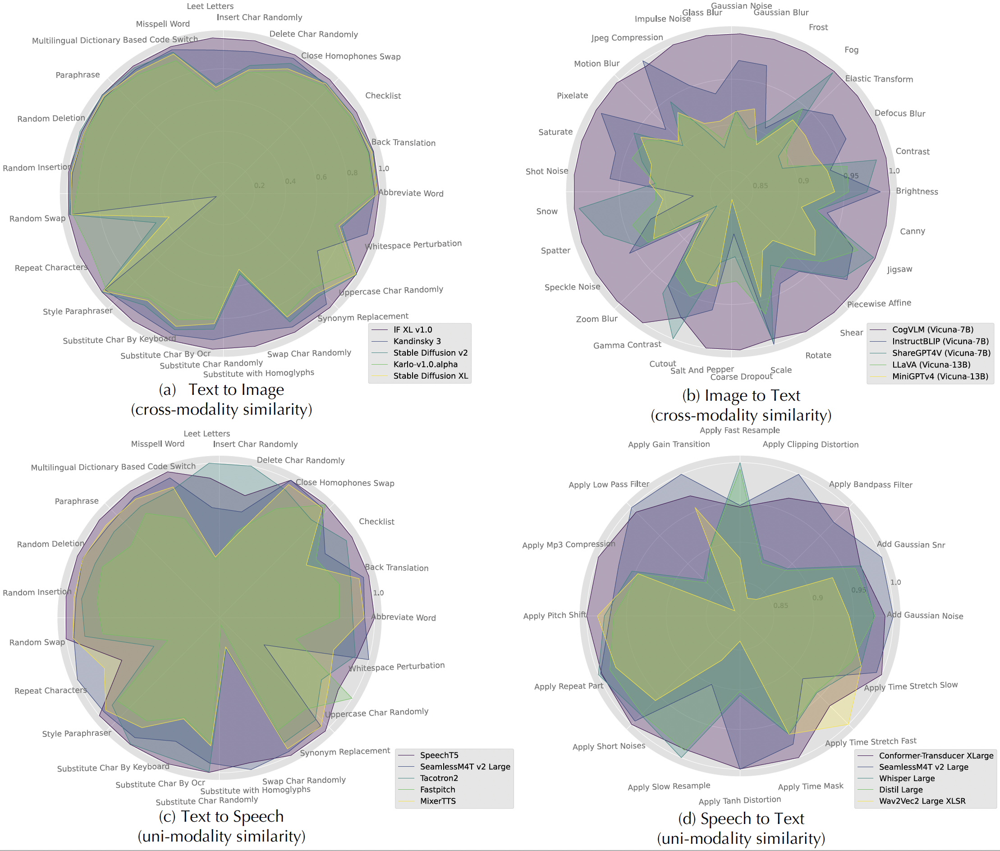

# MMCBench: Benchmarking Large Multimodal Models against Common Corruptions 🚀

Code for the paper [Benchmarking Large Multimodal Models against Common Corruptions](https://arxiv.org/abs/2401.11943).

## Overview

MMCBench is a comprehensive benchmarking framework designed to evaluate the robustness and self-consistency of Large Multimodal Models (LMMs) under common corruption scenarios. This framework focuses on cross-modal interactions involving text, image, and speech, covering essential generative tasks such as text-to-image, image-to-text, text-to-speech, and speech-to-text. Our benchmarking approach uses a novel methodology for selecting representative examples from large datasets and employs a consistent metric system for performance measurement across various cross-modalities.

## Benchmarking Process 📈

The selection and evaluation process for cross-modality consistency in MMCBench involves two main steps:

1. **Selection Process** 🕵️‍♂️: This step involves determining similarity based on text modality, using model-generated captions or transcriptions for non-text inputs, and directly comparing text inputs before and after corruption.

2. **Evaluation Process** 📝: This step measures self-consistency by comparing clean inputs with outputs from corrupted inputs and comparing outputs from clean and corrupted inputs against each other.

### Overview of the Selection and Evaluation Process 📌



## Model Resilience Analysis 🛡️

We present radar charts depicting the relative consistency scores of selected models for various corruptions across four cross-modality tasks: text-to-image 🎨, image-to-text 📜, text-to-speech 🗣️, and speech-to-text 📝. The scores are normalized with the highest scoring model set as the baseline for each type of corruption, allowing for a comparative analysis of each model's resilience.

### Radar Charts of Model Consistency Scores 🎯



## Repository Structure 📂

- `MMCBench/`
  - `image2text/`: Image-to-Text generation tasks.
  - `speech2text/`: Speech-to-Text generation tasks.
  - `text2image/`: Text-to-Image generation tasks.
  - `text2speech/`: Text-to-Speech generation tasks.
    
## Environment Setup 🌐

To set up the environment for running MMCBench, we recommend using Conda, which can handle packages and dependencies effectively. Follow these steps to create and activate a Conda environment:

1. **Create a Conda Environment**: Open your terminal and run the following command to create a new environment named `mmcbench_env`:

   ```
   conda create -n mmcbench python=3.9
   ```

2. **Activate the Environment**: Activate the newly created environment:

   ```
   conda activate mmcbench
   ```

3. **Install Required Packages**: Install all necessary packages using the `requirements.txt` file included in the repository:

   ```
   pip install -r requirements.txt
   ```

## Getting Started 🚦

To begin using MMCBench, clone this repository and follow the setup instructions in each module. Detailed documentation for each step of the benchmarking process is provided. All the related corrupted data is available on [Hugging Face](https://huggingface.co/datasets/javyduck/MMCBench).

## Contributions 👐

MMCBench is an open-source project, and contributions are welcome. If you wish to contribute, please submit a pull request or open an issue to discuss your proposed changes.

## License 📄

This project is licensed under the Apache 2.0 License - see the [LICENSE](LICENSE) file for details.

## Acknowledgments 🎉

We thank all contributors and participants who have made MMCBench a comprehensive benchmark for evaluating large multimodal models.
